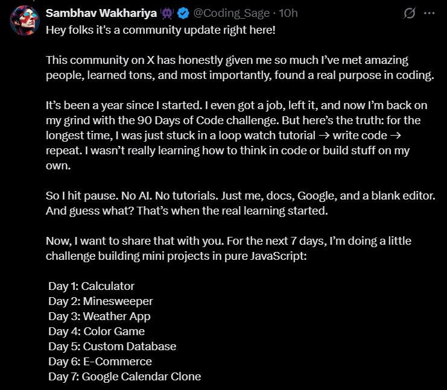

# 🚀 7 Days JavaScript Practical Implementation Challenge

Welcome to the **7 Days JavaScript Challenge**!  
This repo is a celebration of learning, building, and breaking out of the tutorial loop. If you’ve ever felt stuck watching endless tutorials, this is your invitation to start thinking like a real developer.

## 🌟 Why This Challenge?

After a year of coding, meeting amazing people, and finding purpose, I realized true growth comes from *doing*, not just watching. So, I paused the tutorials, skipped the AI, and dove into docs, Google, and a blank editor. That’s when the magic happened.

Now, I’m sharing that journey with you. For the next 7 days, I’ll be building mini-projects in pure JavaScript—no frameworks, no shortcuts. Just code, creativity, and community.

## 🗓️ The Projects

| Day | Project                | Description                        |
|-----|------------------------|------------------------------------|
| 1   | Calculator             | Build a simple, functional calculator. |
| 2   | Minesweeper            | Classic game, pure JS logic.       |
| 3   | Weather App            | Fetch and display live weather data. |
| 4   | Color Game             | Fun with colors and DOM manipulation. |
| 5   | Custom Database        | Create a mini in-browser database. |
| 6   | E-Commerce             | Basic shopping cart experience.    |
| 7   | Google Calendar Clone  | Recreate calendar UI & features.   |

## 📝 How It Works

- **Every morning at 6 AM:** I’ll drop a short video explaining the day’s project and steps.
- **You build:** No shortcuts, no copy-paste. Just you and your editor.
- **Share your code:** Push your work to GitHub. Keep it clean, keep it structured.
- **Break the tutorial trap:** Learn to think, debug, and build like a developer.

## 💡 Who Should Join?

- Anyone learning JavaScript
- Devs stuck in the tutorial loop
- Builders who want to level up
- Anyone who loves a good challenge!

## 🤝 How to Participate

1. **Fork this repo** and clone it locally.
2. **Build each project** in its own folder (`/Day1-Calculator`, `/Day2-Minesweeper`, etc.).
3. **Share your progress** on X (Twitter) and GitHub.
4. **Tag your friends**—let’s grow together!

## 📣 Spread the Word!

Know someone who needs a push? Share this challenge!  
Let’s build, struggle, debug, and grow—together.

---

**Ready to break out of the tutorial trap?**  
Let’s code. Let’s learn. Let’s win.
